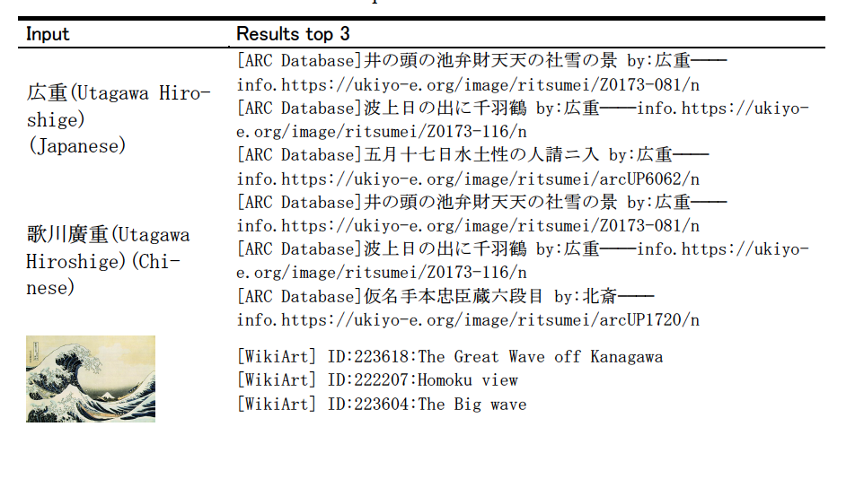

# simple_demoForMAWukiyoeSys
This is an example of a simple implementation of the paper Towards an artwork information embedding framework for retrieval on multi-source ukiyo-e records 




Due to copyright issues, retrieval results only displays links to art work information.


How to use：

----------
step1:
dowload the pre-trained model multi_cased_L-12_H-768_A-12 from https://github.com/google-research/bert/blob/master/README.md

run:
```python
bert-serving-start -model_dir  multi_cased_L-12_H-768_A-12 -num_worker=

```
```python
python3 MAWukiyoe.py --artists_Name 広重

```

```python
python3 MAWukiyoe.py --Image_path the-great-wave-of-kanagawa-1831.jpeg

```
```python
python3 MAWukiyoe.py --keyword 日本橋夜景

```
References
----------
https://github.com/hanxiao/bert-as-service
https://github.com/facebookresearch/pysparnn
https://umap-learn.readthedocs.io/en/latest/

Authors
-------

- @Kangying Li 


License
-------
